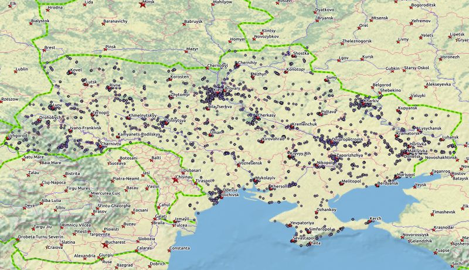

## Slide 1

Idea: collect tweets from Twitter

Look at:

1. how Twitter activity changes with time
2. user ID, check for hot spots (robots?)
3. average length of a tweet

--- .class #id

## Slide 2

Prerequisites in my http://github.com/koskot77/DevDataProducts/

1. q.py - a Twitter API client (tokens removed)
2. tweet_users.py - a prepossessing script
3. server.R and ui.R - Shiny application

--- .class #id

## Slide 3

Results are available at: https://koskot77.shinyapps.io/twitter/

Github repository is: https://github.com/koskot77/DevDataProducts

--- .class #id

## Slide 4

Geography of the tweets:

--- .class #id

## Slide 5

Summary:

1. Identified several spammers (e.g. userId=2571277046) pushing advertisements round the clock (robot)
2. Found a bunch of emoji abusers (generating lengthy tweets)
3. Discovered that majority of users do not care for politics 
